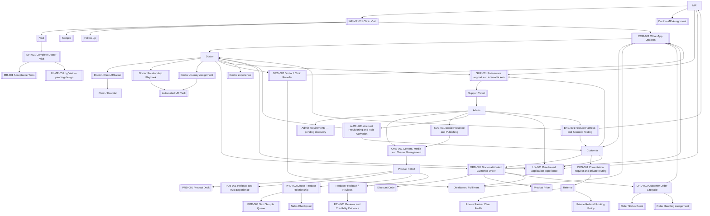

# Srasveda Product Home

## Product intent

Turn `srasveda.com` into the digital operating layer for Srasveda’s existing doctor-led women’s wellness business. The platform must connect field activity, doctor–clinic relationships, customer orders, regular doctor/distributor orders, fulfilment and repeat ordering. It does not replace MRs or require a native app.

## Map

## Confirmed product boundaries

- One responsive web application at `srasveda.com`.
- MRs use phones now and tablets later.
- Public, MR and admin areas share a platform but have separate permissions.
- Shared chrome is the reusable [[requirements/DS-CORE Shared UI System]] module. Role workspaces and Auth/Payment import it; they do not copy Button/Field. See [[decisions/ADR-003 Shared UI System Module]].
- Phone OTP is primary login; email is optional. OTP session is the reusable [[requirements/AUTH-CORE Phone OTP Session]] module; doctor/customer roles are the Srasveda adapter [[requirements/AUTH-001 Account Provisioning and Role Activation]].
- Admin may pre-provision doctor accounts; self-service mobile OTP creates a customer account by default until an authorised role promotion/verification occurs.
- Hosted payment is the reusable [[requirements/PAY-CORE Hosted Payment Adapter]] module; packing and WhatsApp wait on Srasveda’s [[requirements/PAY-001 Verified Online Payment]] adapter.
- Patient medical records are out of scope.
- Customers can order directly at Srasveda-controlled prices; consultation routing is optional and does not expose a public partner directory.
- Heritage communication is evidence-led: “Founded in 1998” is displayed only with approved source evidence and claim review.
- Routine product media, approved content and controlled theme settings are managed from admin; they do not require a code deployment.
- Official social profiles, share links and approved social content are centrally managed; automated publishing is optional and follows platform approval/credentials.
- Every build feature is an isolated vertical slice with a harness: requirements, permission rules, test data, automated tests, observable events and release checks.
- Distributor portal still needs its own specification; build order is not yet approved.

## Work in order

1. [[workflows/WF-MR-001 Clinic Visit]] — map the real current process and proposed future flow.
2. [[workflows/WF-ORD-001 Doctor Attributed Customer Order]] — specify customer ordering and doctor attribution.
3. [[workflows/WF-ORD-002 Doctor Clinic Reorder]] — specify regular doctor/clinic ordering.
4. Review feature requirements, then create linked screen specifications and low-fidelity wireframes.
5. Write/approve acceptance tests. Only approved requirements are eligible to build.

## Build readiness

Use [[Build Readiness Checklist]] to see what is covered, what is still a business decision, and what must be designed/tested before development starts.

Use [[Founder Decision Workbook]] to approve or amend the recommended starting policies behind those decisions.

## Open evidence log

Use [[discovery/Open Questions]] for facts not yet known. Open questions are not defects; they are safeguards against accidental invention.
