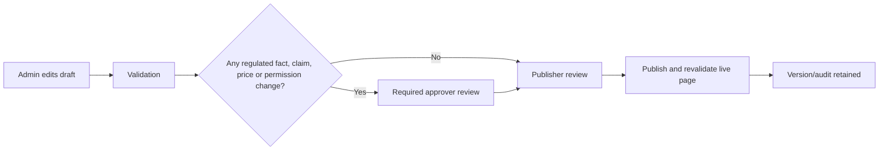

# UI-ADM-004 — Admin Product Workspace

## Job to be done

An authorised admin can prepare, verify, approve and publish every fact needed for one product/SKU from one controlled workspace—without editing source code, hunting through folders or accidentally publishing an unapproved claim.

## Entry

`Admin → Content Studio → Products → [Product/SKU]`

## Page chrome

```text
Product Workspace: [Product name] [SKU]                 Draft v4
Status: Needs classification review                     [Preview] [Save draft]
Owner: [name] | Last reviewed: [date]                   [Submit for review]

Tabs: Overview | Classification & Evidence | Commercial | Public Content |
      Professional & MR | Claims | Media | Reviews | History
```

## Overview

```text
Product name                 [text]
Internal SKU                 [text]
Pack / variant               [text/dropdown]
Product status               [Draft / Active / Archived]
Product owner                [admin dropdown]
Next mandatory review date   [date]
```

## Classification & Evidence

```text
Regulatory classification    [approved dropdown]
Manufacturer                 [approved record]
Licence / reference          [text + upload evidence]
Pack-label images/PDF        [media picker]
Evidence/source notes        [internal only]
Reviewer / decision          [read-only audit]
```

This tab cannot be published by a content editor. If classification/evidence is incomplete, the public product page is blocked.

## Commercial

```text
MRP                           [amount]
Current selling price          [amount]
Tax treatment                  [approved dropdown]
Effective from / until         [dates]
Public availability            [Active / paused / out of stock]
Audience price rules           [public / doctor / clinic, as approved]
```

Price changes create a new [[domain/Product Price]] record; they never rewrite a completed order’s price snapshot.

## Public Content

```text
Public short description       [text]
Public product description     [rich/plain approved text]
Ingredients / composition      [structured list]
Directions                     [structured text]
Warnings / precautions         [structured text]
Storage / pack information     [structured text]
FAQ                            [approved question/answer list]
SEO title / description        [text]
```

Every public field displays its approval state and the source version. The preview shows how it appears to a customer; it does not expose internal/doctor-only content.

## Professional & MR Resources

```text
Doctor deck / PDF              [approved media]
MR presentation sections       [approved content]
Internal sample guidance       [internal-only rules]
Audience visibility            [Public / Doctor / MR / Admin]
```

## Claims

```text
Statement                      [exact wording]
Type                           [benefit / ingredient / safety / comparison / other]
Product/category scope         [SKU/category]
Audience                       [public / doctor / MR]
Evidence/source                [link/upload]
Approver / review date         [read-only once submitted]
Status                         [draft / rejected / approved / expired]
```

No `approved` claim can be freely rewritten. A changed sentence creates a new draft claim and requires review again.

## Media

```text
Primary pack image             [select/upload]
Gallery / label images         [reorder/select/upload]
Product PDFs / videos          [attach]
Alt text                       [required]
Usage rights / source          [required]
Where used                     [public page / doctor deck / MR presentation / social]
```

## Reviews and History

- Reviews/perspectives are selected from the approval-controlled records defined in [[requirements/REV-001 Reviews and Credibility Evidence]] and [[requirements/VID-001 Doctor Video Perspectives]].
- History shows who changed what, the prior/new version, approval/rejection reason, publication time, rollback and urgent-unpublish action.

## Publish logic



## Permissions

| Role | Can do |
| --- | --- |
| Content editor | Prepare text/media drafts; cannot publish regulated changes. |
| Product/regulatory approver | Approve/reject classification, label facts, claims, directions, warnings and professional resources. |
| Commercial admin | Prepare/approve authorised price records. |
| Publisher/admin | Publish an already-approved version, pause/unpublish and roll back. |
| MR/doctor/customer | No Product Workspace access. |

## Must not allow

- Direct editing of application source code, arbitrary scripts/CSS, completed order price snapshots or historical audit records.
- Public publication with missing classification, price, required warnings, approval or evidence.
- Reuse of generic/static “verified” reviews or unapproved doctor video.

## Links

- [[requirements/CMS-001 Content, Media and Theme Management]]
- [[domain/Product]]
- [[domain/Product Price]]
- [[domain/Content Publication]]
- [[discovery/Existing Product Content Audit]]
