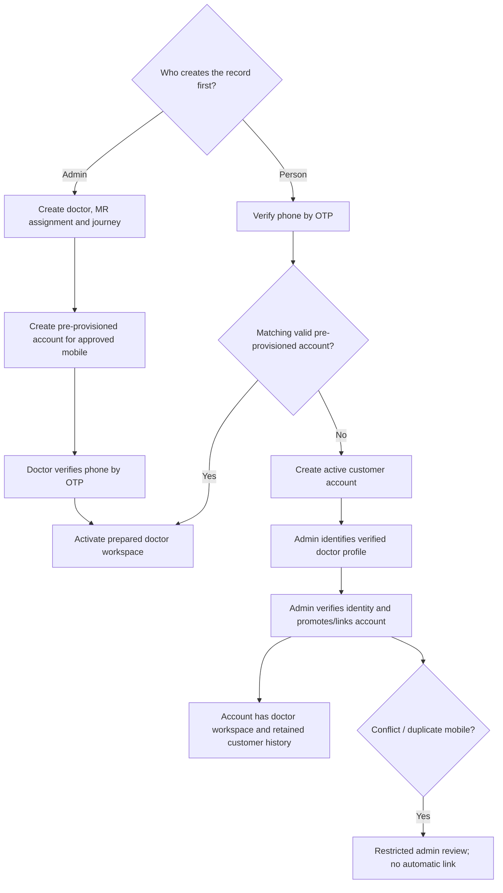

# WF-AUTH-001 — Account Provisioning and Role Activation

```mermaid
flowchart TD
  A{Who creates the record first?}
  A -- Admin --> B[Create doctor, MR assignment and journey]
  B --> C[Create pre-provisioned account for approved mobile]
  C --> D[Doctor verifies phone by OTP]
  D --> E[Activate prepared doctor workspace]

  A -- Person --> F[Verify phone by OTP]
  F --> G{Matching valid pre-provisioned account?}
  G -- Yes --> E
  G -- No --> H[Create active customer account]
  H --> I[Admin identifies verified doctor profile]
  I --> J[Admin verifies identity and promotes/links account]
  J --> K[Account has doctor workspace and retained customer history]

  J --> L{Conflict / duplicate mobile?}
  L -- Yes --> M[Restricted admin review; no automatic link]
```

Phone OTP proves control of a mobile number. It does not independently prove professional identity or grant doctor access.
