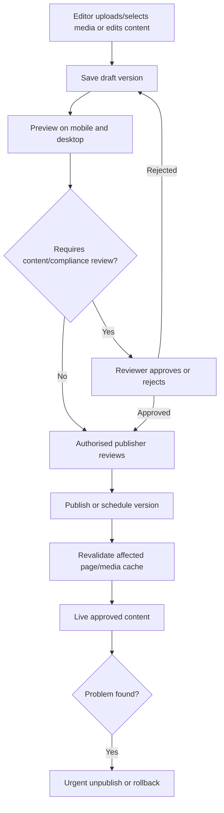

# WF-CMS-001 — Publish Content Change

```mermaid
flowchart TD
  A[Editor uploads/selects media or edits content] --> B[Save draft version]
  B --> C[Preview on mobile and desktop]
  C --> D{Requires content/compliance review?}
  D -- Yes --> E[Reviewer approves or rejects]
  D -- No --> F[Authorised publisher reviews]
  E -- Approved --> F
  E -- Rejected --> B
  F --> G[Publish or schedule version]
  G --> H[Revalidate affected page/media cache]
  H --> I[Live approved content]
  I --> J{Problem found?}
  J -- Yes --> K[Urgent unpublish or rollback]
```

Routine publishing changes stored content. New layouts/features still follow the design, code-review and deployment process.
