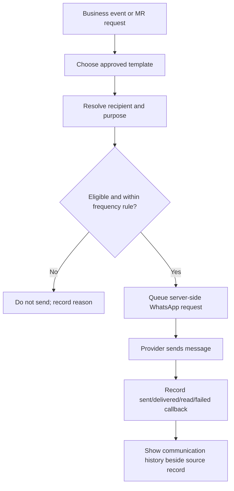

# WF-COM-001 WhatsApp Updates

## Example: doctor after visit

1. MR completes a visit and chooses “Send approved product resource.”
2. System selects the relevant doctor resource template and product link.
3. System checks the doctor’s mobile, communication preference and message cadence.
4. System sends/records the message attempt.
5. The doctor profile timeline shows the resource was sent; the next follow-up remains independently due.
