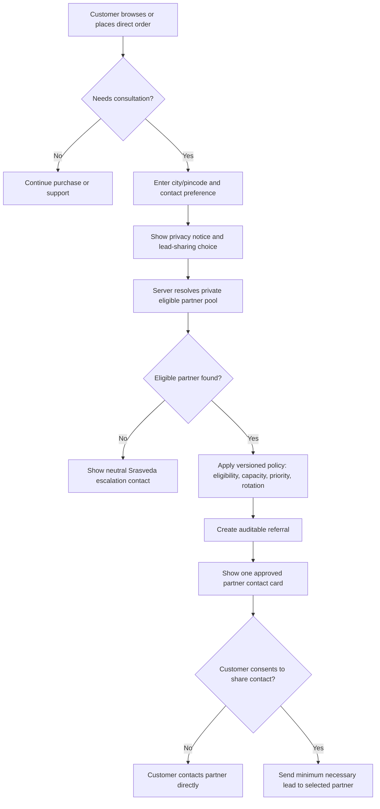

# WF-CON-001 — Consultation Routing

```mermaid
flowchart TD
  A[Customer browses or places direct order] --> B{Needs consultation?}
  B -- No --> C[Continue purchase or support]
  B -- Yes --> D[Enter city/pincode and contact preference]
  D --> E[Show privacy notice and lead-sharing choice]
  E --> F[Server resolves private eligible partner pool]
  F --> G{Eligible partner found?}
  G -- No --> H[Show neutral Srasveda escalation contact]
  G -- Yes --> I[Apply versioned policy: eligibility, capacity, priority, rotation]
  I --> J[Create auditable referral]
  J --> K[Show one approved partner contact card]
  K --> L{Customer consents to share contact?}
  L -- No --> M[Customer contacts partner directly]
  L -- Yes --> N[Send minimum necessary lead to selected partner]
```

The matching pool, alternative partners and network size remain internal. The customer sees one selected card or a neutral no-match path.
