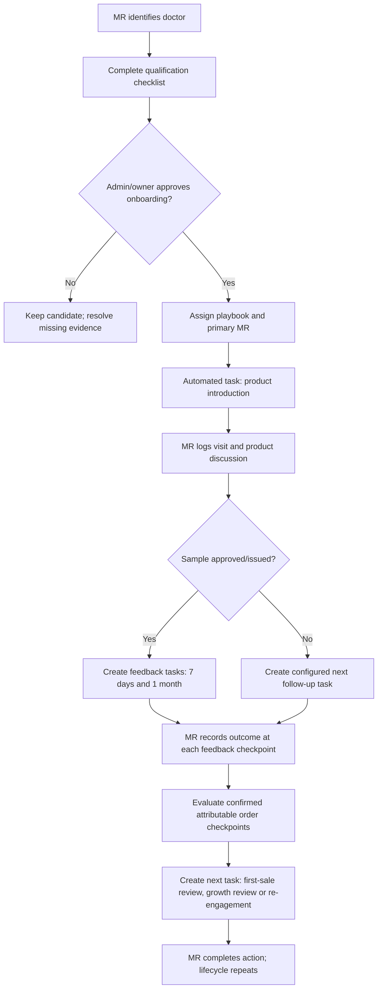

# WF-DOR-001 — Doctor Relationship Lifecycle

Every automated task stores the originating playbook/checkpoint version and evidence. Automation proposes and tracks work; people record real-world facts.
