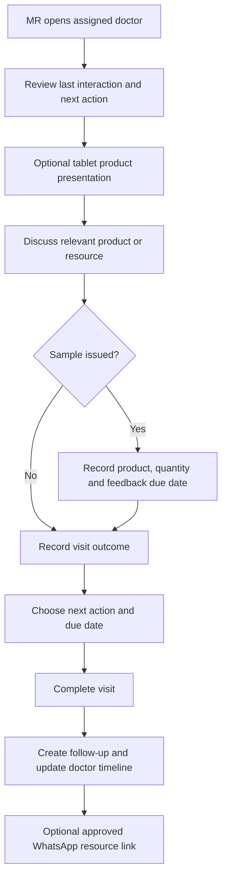

# WF-MR-001 Clinic Visit

## Purpose

Represent the real doctor interaction from preparation through the next follow-up. This workflow must be validated with both MRs before it becomes `approved`.

## Proposed future-state flow

## Current-state evidence needed

- How MRs choose the day’s clinics.
- Typical duration of a doctor interaction.
- Existing sample register/notebook/WhatsApp process.
- Existing follow-up reminder method.
- Meaning of a successful versus unsuccessful visit.
- Who enters/receives an order after the doctor agrees.

## Exceptions to map

- Doctor unavailable.
- Doctor is no longer practising/moved.
- MR cannot connect to the internet.
- Sample stock unavailable.
- Doctor asks for a resource but not a sample.
- Follow-up is postponed repeatedly.

## Approval gate

This workflow cannot move to `approved` until both MRs confirm it reflects a normal clinic visit and identify any missing exception.
