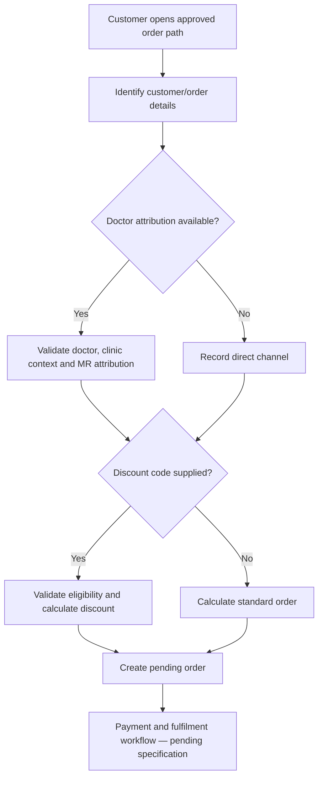

# WF-ORD-001 Doctor-Attributed Customer Order

```mermaid
flowchart TD
  A[Customer opens approved order path] --> B[Identify customer/order details]
  B --> C{Doctor attribution available?}
  C -- Yes --> D[Validate doctor, clinic context and MR attribution]
  C -- No --> E[Record direct channel]
  D --> F{Discount code supplied?}
  E --> F
  F -- Yes --> G[Validate eligibility and calculate discount]
  F -- No --> H[Calculate standard order]
  G --> I[Create pending order]
  H --> I
  I --> J[Payment and fulfilment workflow — pending specification]
```

## Required decisions before approval

See open questions in [[requirements/ORD-001 Doctor Attributed Customer Order]].
