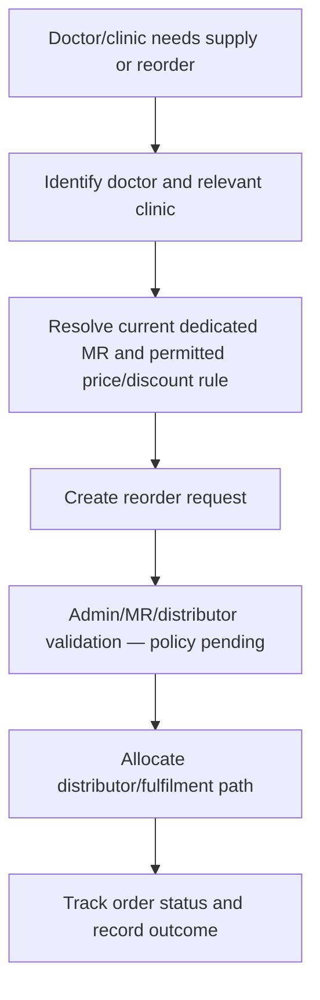

# WF-ORD-002 Doctor / Clinic Reorder

```mermaid
flowchart TD
  A[Doctor/clinic needs supply or reorder] --> B[Identify doctor and relevant clinic]
  B --> C[Resolve current dedicated MR and permitted price/discount rule]
  C --> D[Create reorder request]
  D --> E[Admin/MR/distributor validation — policy pending]
  E --> F[Allocate distributor/fulfilment path]
  F --> G[Track order status and record outcome]
```

This is deliberately a draft until the actual current ordering practice is documented.
