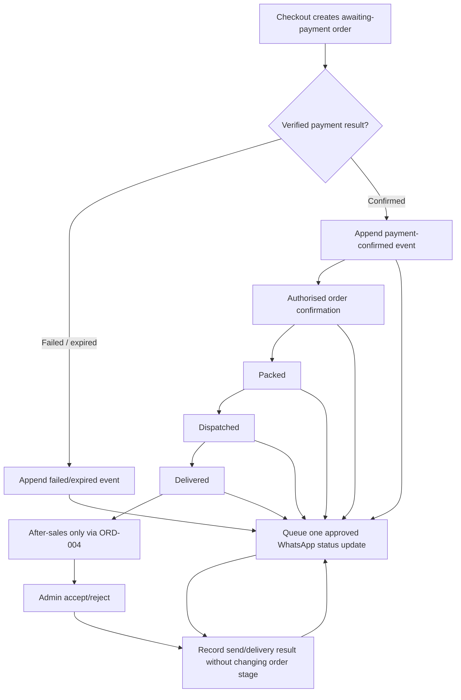

# WF-ORD-003 — Customer Order Lifecycle

Each status is an append-only event with source evidence. The WhatsApp update reflects the event; it never creates the event. A customer/doctor request is not an order stage — see [[workflows/WF-ORD-004 Manual After-sales]].
