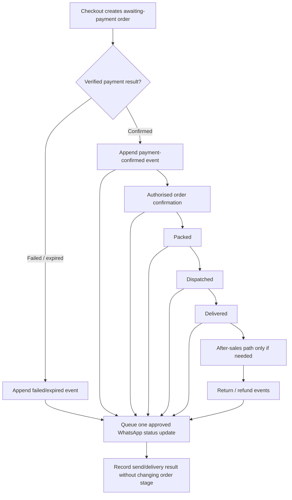

# WF-ORD-003 — Customer Order Lifecycle

```mermaid
flowchart TD
  A[Checkout creates awaiting-payment order] --> B{Verified payment result?}
  B -- Failed / expired --> C[Append failed/expired event]
  B -- Confirmed --> D[Append payment-confirmed event]
  D --> E[Authorised order confirmation]
  E --> F[Packed]
  F --> G[Dispatched]
  G --> H[Delivered]
  H --> I[After-sales path only if needed]
  I --> J[Return / refund events]

  C --> W[Queue one approved WhatsApp status update]
  D --> W
  E --> W
  F --> W
  G --> W
  H --> W
  J --> W
  W --> K[Record send/delivery result without changing order stage]
```

Each status is an append-only event with source evidence. The WhatsApp update reflects the event; it never creates the event.
