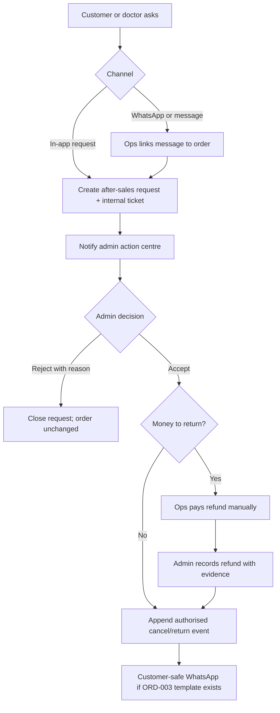

# WF-ORD-004 — Manual after-sales

```mermaid
flowchart TD
  A[Customer or doctor asks] --> B{Channel}
  B -- In-app request --> C[Create after-sales request + internal ticket]
  B -- WhatsApp or message --> D[Ops links message to order]
  D --> C
  C --> E[Notify admin action centre]
  E --> F{Admin decision}
  F -- Reject with reason --> G[Close request; order unchanged]
  F -- Accept --> H{Money to return?}
  H -- No --> I[Append authorised cancel/return event]
  H -- Yes --> J[Ops pays refund manually]
  J --> K[Admin records refund with evidence]
  K --> I
  I --> L[Customer-safe WhatsApp if ORD-003 template exists]
```

A request is never a cancellation. A refund is never automatic.
