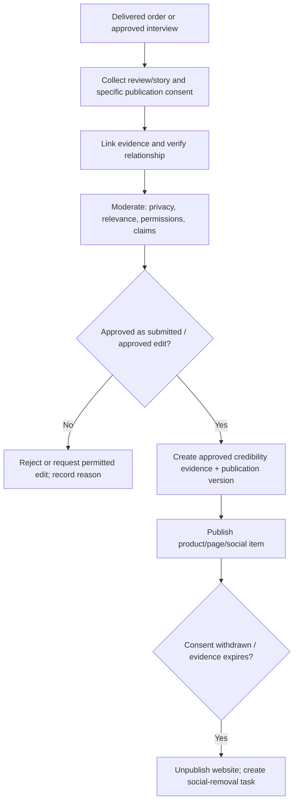

# WF-REV-001 — Review and Story Publication

```mermaid
flowchart TD
  A[Delivered order or approved interview] --> B[Collect review/story and specific publication consent]
  B --> C[Link evidence and verify relationship]
  C --> D[Moderate: privacy, relevance, permissions, claims]
  D --> E{Approved as submitted / approved edit?}
  E -- No --> F[Reject or request permitted edit; record reason]
  E -- Yes --> G[Create approved credibility evidence + publication version]
  G --> H[Publish product/page/social item]
  H --> I{Consent withdrawn / evidence expires?}
  I -- Yes --> J[Unpublish website; create social-removal task]
```

Moderation protects accuracy and privacy. It is not a mechanism to hide legitimate negative feedback.
