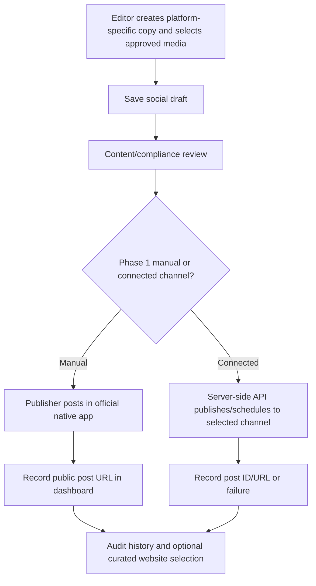

# WF-SOC-001 — Social Content Publication

```mermaid
flowchart TD
  A[Editor creates platform-specific copy and selects approved media] --> B[Save social draft]
  B --> C[Content/compliance review]
  C --> D{Phase 1 manual or connected channel?}
  D -- Manual --> E[Publisher posts in official native app]
  E --> F[Record public post URL in dashboard]
  D -- Connected --> G[Server-side API publishes/schedules to selected channel]
  G --> H[Record post ID/URL or failure]
  F --> I[Audit history and optional curated website selection]
  H --> I
```

The website is the canonical product/order destination; social posts link back to it with tracked, approved URLs.
