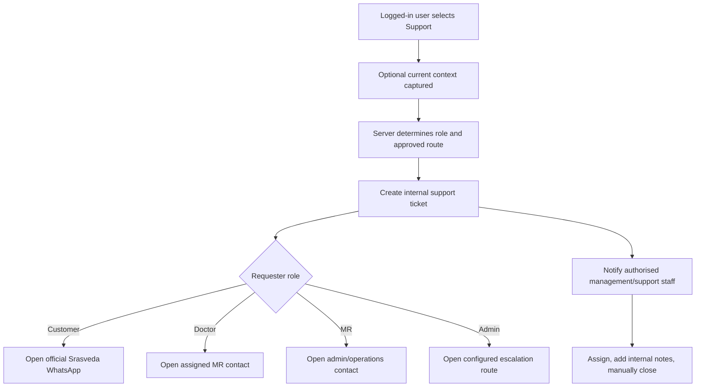

# WF-SUP-001 — Support Request

```mermaid
flowchart TD
  A[Logged-in user selects Support] --> B[Optional current context captured]
  B --> C[Server determines role and approved route]
  C --> D[Create internal support ticket]
  D --> E{Requester role}
  E -- Customer --> F[Open official Srasveda WhatsApp]
  E -- Doctor --> G[Open assigned MR contact]
  E -- MR --> H[Open admin/operations contact]
  E -- Admin --> I[Open configured escalation route]
  D --> J[Notify authorised management/support staff]
  J --> K[Assign, add internal notes, manually close]
```

The requester does not see the internal ticket lifecycle and receives no ticket-status notifications from the platform.
